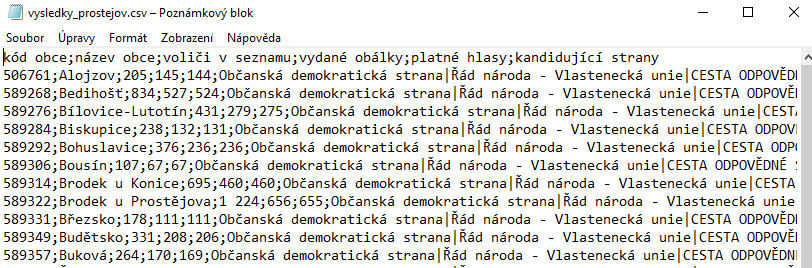

# Web scraper

Skript, který umožňuje vytáhnout data z webu [výsledků voleb z roku 2017](https://volby.cz/pls/ps2017nss/ps3?xjazyk=CZ)
.  
Vstupem programu je odkaz/link na stránku územního celku, který chceme scrapovat.
Skript projde všechny obce daného celku a do výstupního CSV souboru (oddělovač je `;`) uloží tyto informace:

1. kód obce
2. název obce
3. voliči v seznamu
4. vydané obálky
5. platné hlasy
6. kandidující strany (oddělené znakem `|`)

## Instalace nezbytných knihoven

Skript využívá knihovny requests, pandas a BeautifulSoup, všechny lze nainstalovat pomocí:

```bash
pip install -r requirements.txt
```

## Spuštění skriptu

Skript vyžaduje dva argumenty. První je odkaz/link na stránku územního celku, který chceme scrapovat.
Druhý argument je název výstupního souboru.

```bash
python scraper.py [link] [output_file]
```

## Ukázka

Spustíme-li skript s následujícími argumenty, tak bude výstupem soubor `vysledky_prostejov.csv`,
který bude obsahovat na jednotlivých řádcích vybrané statistiky pro jednotlivá města územního celku Prostějov.

```bash
python scraper.py https://volby.cz/pls/ps2017nss/ps32?xjazyk=CZ&xkraj=12&xnumnuts=7103 vysledky_prostejov.csv
```

Prvních několik řádků výstupního souboru:


